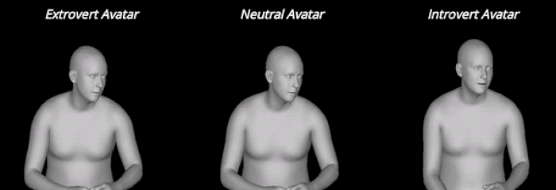

# Personality-Aware Non-verbal Behavior Generation in Dyadic Interactions

[]()
[]()
[]()
[]()
[]()
[](https://master-thesis-amr-amer.streamlit.app/)
[]()
[]()


**Master Thesis Project**  

Author: **Amr Amer**  
[Email](mailto:amribrahim.amer@gmail.com) | [LinkedIn](https://www.linkedin.com/in/amr-amer-2023-cs/) 

---


## Table of Contents
- [Overview](#-overview)
- [Demo](#-demo)
- [Method](#method)
- [Evaluation](#-evaluation)
- [Thesis Document](#-thesis-document)
- [Installation](#-installation)
- [Citation](#-citation)

---

## 📌 Overview
This work proposes a **transformer-based architecture** for generating non-verbal listener behavior in dyadic interactions.  
The generated avatar behavior is **conditioned on personality traits** (specifically Extraversion) and incorporates:

- Facial expressions (jaw, micro-expressions)
- Upper body posture and dynamics
- Hand gestures
- Audio & multimodal cues from the speaker

 The system achieves **state-of-the-art performance** for multimodal behavior generation on the **UDIVA** dataset.

 **Target Use Cases:**

- Social VR and digital avatars
- Conversational AI / customer service bots
- Virtual therapy and coaching systems
- Human-robot interaction (HRI)

---

## 🚀 Demo



***See the demo video and project details on Website***

 [](https://master-thesis-amr-amer.streamlit.app/)


---

## ⚙️ Method

---

## 📈 Evaluation

This model was evaluated on the **UDIVA dyadic dataset**, using metrics for motion realism, personality perception, and behavioral engagement.

- Dataset description: https://chalearnlap.cvc.uab.es/dataset/41/description/

---

### **➜ Quantitative Performance**

We evaluate the model using four core metrics:

| Metric | Purpose | Good Indicator |
|--------|----------|----------------|
| **L2 Distance ↓** | Fit to ground truth motion | Lower is better |
| **FID ↓** | Realism of generated sequences | Lower is better |
| **P-FID ↓** | Plausibility of joint speaker-listener behavior | Lower is better |
| **Variance ↑** | Behavioral diversity | Higher is better |

| Model                                  | Face L2 ↓ | Face FID ↓ | Face P-FID ↓ | Face Var ↑ | Body L2 ↓ | Body FID ↓ | Body P-FID ↓ | Body Var ↑ |
|----------------------------------------|------------|-------------|---------------|-------------|-------------|--------------|----------------|--------------|
| Personality-agnostic Baseline          | 32.45      | 7.67        | 10.47         | 1.39        | 75.29       | 58.87        | 96.82          | 0.97         |
| Ours – Joint Body/Face Representation  | 33.05      | 8.65        | 11.94         | 1.49        | 74.41       | 51.90        | 91.49          | 0.84         |
| Ours – Random Extraversion Scores      | 32.76      | 7.58        | 10.83         | **1.61**    | 73.23       | 47.56        | 91.33          | **1.13**     |
| **Ours (Final Model)**                 | **32.12**  | **6.15**    | **10.31**     | 1.54        | **72.26**   | **43.16**    | **87.73**      | 1.03         |

**Conclusion:**  

The final model demonstrates improved distribution alignment (FID, P-FID) and behavioral variability, generating more realistic and expressive listener avatars.

---

### **➜ User Study**

Two user perception studies (n = 20 participants) were conducted to validate:

| Objective | Outcome |
|-----------|----------|
| Distinguish introvert vs. extrovert avatars | **86%** participant accuracy |
| Preference vs. personality-agnostic model | **71%** preferred our model |

Study setup:

- 6 randomly sampled listeners per experiment
- Highest/lowest extraversion values used for conditioning
- Video order and left-right placement randomized to avoid bias

---

### **➜ Qualitative Results**

Generated avatars exhibit recognizable behavioral traits:

| Personality | Observed Behaviors |
|-------------|--------------------|
| **Introverted** | Less eye contact, limited gestures, reduced dynamics |
| **Extroverted** | More smiling, leaning toward speaker, energetic gestures |

These traits arise **emergently** from personality conditioning, without rule-based animation.

---

### 🔗 Additional Visuals and Evaluations

Interactive charts, plots, video samples, and comparative demonstrations are available on the website:

➡️ **Full Evaluation & Visualizations**  

 [](https://master-thesis-amr-amer.streamlit.app/)

---

### 📄 Thesis Document

For full technical and academic context, the complete Master's Thesis is available:

[**View / Download Thesis (PDF)**](docs/Thesis_final_doc.pdf)

It contains the architecture breakdown, mathematical formulation, experiment setup,
and full literature review supporting this repository.

---

### 🛠️ Installation

```bash
git clone https://github.com/yourusername/your-thesis-repo.git
cd your-thesis-repo
pip install -r requirements.txt
streamlit run src/streamlit_app.py
```

---

### 📜 Citation

If you use this work in your research or publications, please cite:

```bibtex
@mastersthesis{amer2024personalityaware,
  title        = {Personality-Aware Non-verbal Behavior Generation in Dyadic Interactions},
  author       = {Amer, Amr},
  year         = {2024},
  institution  = {Saarland University},
  type         = {Master's Thesis}
}

